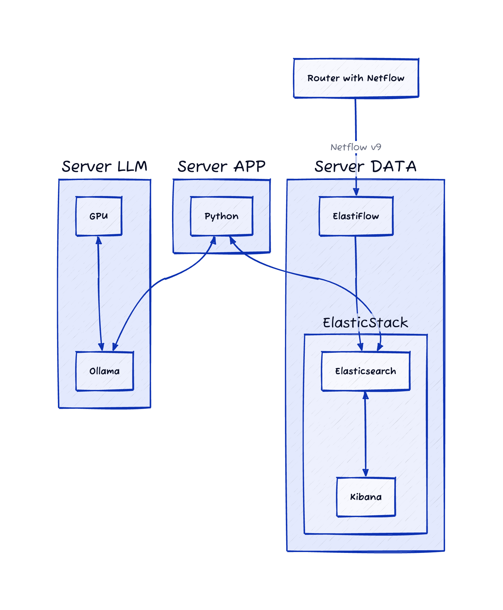

# llm-netflow-elk-chatbot

[](https://www.python.org)
[](https://www.python.org)
[](https://www.python.org)
[](https://www.python.org)
[](https://www.python.org)

Small chatbot that allows you to ask Elasticsearch about data from ElasticFlow NetFlow collector using natural language

## Initial remarks

This is a Proof of Concept type of a project. It was never meant to be a fully functional application, free of bugs, with proper data testing and exceptions handling. I meant it just for me, to check if I can code chatbot in one evening, and to evaluate limitations of LLM/SLM models run locally. 

A few people asked me to release the code anyway, so here it is :) 

## Architecture



## Usage

Just download the project, creare ```.env``` file (or not) to override default configuration variables and run code from the ```main.py```:

```shell
usage: main.py [-h] [--override-dsl] [--debug]

NetFlow Chat - Ask your questions in English.

options:
  -h, --help      show this help message and exit
  --override-dsl  Override DSL template from LLM with one in dsl_query_example.json file.
  --debug         Enable debug mode so you can so what is actually happening.

```

## Getting involved

If you want to contribute to this project, feel free to fork it and then send your proposal using a [Pull Request](https://github.com/WojciechowskiPiotr/llm-netflow-elk-chatbot/pulls).
